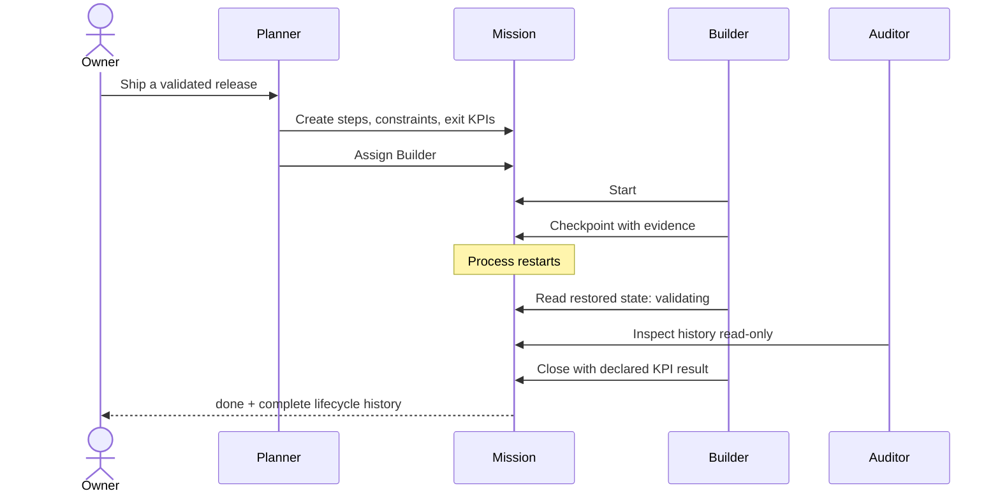

# Mission

## AI agents can act. Mission makes them coordinate.

A chat message is not a work system. It does not guarantee assignment, preserve progress, survive interruption, or enforce declared completion conditions.

Mission gives planners, builders, workers, and auditors a shared state machine for real work: **create, assign, start, checkpoint, block, resume, replace, enter validation, close** — through MCP.

> Agents stop passing intentions around. They move one governed work token toward an explicit end state with a complete history.

[Run the real demo](#run-the-real-demo) · [Explore the roadmap](ROADMAP.md) · [Install v0.1.0](https://github.com/MaximilianoColoma/mission/releases/tag/v0.1.0)

## The failure mode

Without persistent coordination, “multi-agent” often means several isolated chats and one human acting as the message bus:

```text
Planner: “Agent B has the task.”
Agent B: “Which version? What is done? What blocks me?”
Agent C: “I also started it.”
Restart: “The previous state is unavailable.”
Owner: reconnects the whole system manually.
```

Mission makes work state explicit, persistent, role-bound, and auditable.

## See the system move



The repository includes a **real local MCP lifecycle**. It uses signed synthetic planner, worker, and auditor identities, persists the Auftrag, recreates the server, restores the state, lets the auditor inspect history, and closes only after the worker supplies the required KPI key.

**Mission does not verify external evidence in v0.1.0.** Its close gate validates lifecycle state, required KPI keys, and caller-declared `met` values. Independent evidence verification belongs in Witness or a future explicit integration contract.

```text
queued -> assigned -> active -> validating
[restart] state restored: validating
validating -> done
MISSION_DEMO_PASS state=done restart=pass auditor_read=pass kpi_gate=caller_declared history=create,assign,start,checkpoint,close
```

**Evidence class: real local product flow.** The output comes from the actual public MCP server, state machine, identity checks, SQLite database, restart, and changelog. It is not a mock UI.

## Run the real demo

```bash
git clone https://github.com/MaximilianoColoma/mission.git
cd mission
uv sync --locked
uv run python examples/coordinated_autonomy_demo.py
```

## What this enables

### Coordinated autonomy

A planner defines the objective and boundaries. A worker advances only the work assigned to its verified identity. An auditor can inspect without mutating. Admin authority does not bypass lifecycle or acceptance rules.

### Builders that survive interruption

Progress is not trapped inside a model context. Steps, checkpoints, active blocks, prior state, assignments, and history persist across process recreation.

### Safe handoffs and replacement

Work can be reassigned through an explicit replace operation. The predecessor becomes immutable and the replacement inherits specification and remaining steps — not invented claims of completed work.

### Honest blockers

A worker can block without losing the work token, record why, and resume to the previous legal state after resolution.

### Completion with teeth

`done` is not a free-form status change. Required steps must pass and required KPI keys must be present with caller-declared `met` values before close. Invalid transitions fail without partial mutation. External receipt verification is not part of Mission v0.1.0.

## Dream functions

These are **enabled patterns, not bundled orchestration** in v0.1.0:

- **Autonomous builder teams** where planners, implementers, and validators operate independently without losing one shared mission state.
- **Follow-the-sun agent operations** where a new model or host resumes the exact active step after the previous runtime ends.
- **Self-healing workflows** where blocked work wakes after its dependency is resolved and returns to the correct prior state.
- **Dynamic model routing** where expensive specialists receive only missions that require them, while the work token remains stable.
- **Auditable swarms** where parallel agents remain individually attributable instead of collapsing into one shared bot identity.
- **Human-agent organizations** where owners set direction and acceptance while agents coordinate execution behind one inspectable interface.

Mission supplies the governed work state. Agent spawning, schedulers, wake-up infrastructure, cross-host transport, and automatic Witness receipts remain separate integrations.

## Built now — and not yet

| Built in the public core | Not included in v0.1.0 |
|---|---|
| 13 MCP tools across the Auftrag lifecycle | Hosted orchestration control plane |
| Planner, worker, auditor and admin roles | Agent spawning or model execution |
| Signed identity envelopes and exact request binding | Production federation across hosts |
| Assignment eligibility and immutable replacement chains | Telegram, webhook or trigger adapters |
| Steps, checkpoints, blocks, resume and close gates | Automatic Mission-to-Witness bridge |
| Persistent changelog and restart recovery | Multi-tenant SaaS and billing |
| Reproducible Apache-2.0 release artifacts | Customer outcome or scale claims |

Version `0.1.0` is a validated public release. The service is **not deployed** by this repository, and publication is not a production-support or user-impact claim.

## Public MCP surface

| Intent | Tools |
|---|---|
| Create and inspect work | `auftrag_create`, `auftrag_list`, `auftrag_get` |
| Assign and replace | `auftrag_assign`, `auftrag_reassign_replace` |
| Execute | `auftrag_start`, `auftrag_checkpoint` |
| Handle interruption | `auftrag_block`, `auftrag_resume` |
| Finish safely | `auftrag_close`, `auftrag_cancel` |
| Audit | `auftrag_get_changelog`, `get_instance_activity` |

The canonical contracts live under [`spec/`](spec/). Mission consumes the Witness identity-envelope contract through an explicit digest-locked projection; it is not a second protocol authority.

## Install and verify

Requires Python 3.11+ and [uv](https://docs.astral.sh/uv/).

```bash
./install.sh --manifest --json
./install.sh --target "$HOME/.local/share/mission" --non-interactive --json
uv sync --locked
uv run python -m pytest -q -p no:cacheprovider tests repair-tests
uv build
```

The staged installer scrubs inherited Python environment variables, performs a locked installation, writes bounded local configuration/storage, and runs a real MCP first-run doctor.

## Project center

- Product roadmap: [`ROADMAP.md`](ROADMAP.md)
- Governance and release authority: [`GOVERNANCE.md`](GOVERNANCE.md)
- Contributions and DCO: [`CONTRIBUTING.md`](CONTRIBUTING.md)
- Security reporting: [`SECURITY.md`](SECURITY.md)
- Support boundaries: [`SUPPORT.md`](SUPPORT.md)
- Official naming and forks: [`TRADEMARKS.md`](TRADEMARKS.md)

## License

Licensed under the [Apache License 2.0](LICENSE). See [`NOTICE`](NOTICE). Apache-2.0 permits use, modification, redistribution, and commercial use; it does not grant permission to imply official project status or trademark endorsement.
